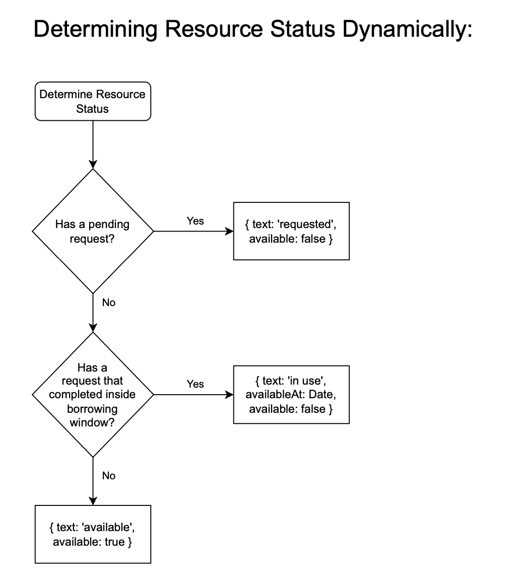

# API Backend for AutoLib
Currently in development.

## Dev Updates:
May 14 (Johannes)
- Implemented search over all fields: ```GET /api/resources?find=term``` will return matches for ```term``` on title, authors, genres, and description.
- Run ```/api/debug/reset``` for the latest seed data updates.
  - Now 76 books from these genres: children, production, programming, theology, thrillers
  - Should have no more dead links to covers.
- Implemented cover image verification on OpenLibrary module. Backend will verify that an OL supplied cover image is retrievable or otherwise discard the URL.
- ```GET /api/resources``` now defaults to order by title if ```?order_by``` is not supplied

May 13 (Johannes)
- Implemented OpenLibrary batch retrieval tool in ```src/db/isbn-batching```. You probably won't need to use it yourself since I already updated the seed data, but here's how it works:
  - ```cd src/db/isbn-batching```
  - put text files with ISBNs into ```data``` diectory
  - run ```node index.js ./data```
  - The script will add resource records for the ISBNs in those files. The genre for each book record will default to the name of the respective text file.

May 12 (Johannes)
- _Schema adjustment!_
  - _Make sure to run /api/debug/reset before testing!_
  - requests table has an added requestee_id field that stores the id of the user to which each request is directed (that is, the person who possessed the requested resource at the time of the requeset)
- ```GET /api/requests/from_me_for_others``` will now return details on the resource and the requested user (requestee) for each request.
- ```GET /api/requests/from_others_for_me``` will now return details on the resource and the requesting user for each request.
- ```GET /api/resources/mine``` now working

May 11 (Johannes)
- ```GET /api/requests/from_me_for_others``` now working
- ```GET /api/requests/from_me_for_others/pending``` now working
- ```GET /api/requests/from_others_for_me``` now working
- ```GET /api/requests/from_others_for_me/pending``` now working
- ```POST /api/requests``` now working
- ```PUT /requests/:id/complete``` now working
- ```GET /api/resources``` now supports ```?order_by=authors```, ```?order_by=genres```

May 10 (Johannes)
- _Schema adjustment!_ 
  - _Make sure to run /api/debug/reset before testing!_
  - Redundant status fields have been removed from resources and requests tables
  - requests table has an added completed_at field (from which status can be inferred)
- ```GET /resources``` and ```GET /resources/:id``` now have status object (dynamically queried) instead of string
- ```PUT /users``` now working. Expects full user object - fields missing in the user record will be deleted from database.

May 9 (Johannes)
- ```POST /login``` now working. Expects object with email address. Sets session cookie.
- ```GET /logout``` now working. Destroys session.
- ```GET /me``` will return the current user record if session is logged in.
- ```GET /api/openlibrary/by_isbn/:isbn``` now working

May 8 (Johannes)
- Schema: resources table now using strings for authors and genres fields (no separate tables)
- ```POST /api/resources``` now working
  - returns the newly created record or an error
  - ```isbn```, ```title``` and ```authors``` are required
  - ```description``` and ```genres``` are optional
  - The fields ```cover_image```, ```current_possessor```, ```owner``` and ```status``` are optional at this time as well. We'll likely supply that data on the backend once we've figured out sessions.
- ```GET /api/users``` now functional (returns all users, not filterable, we probably do not need this in production at all - convenience functionality for now)
- ```GET /api/users/:id``` now functional
- ```POST /api/users``` now working

May 7 (Johannes)
- ```GET /api/resources``` now supporting more filtering (parameters as described below)

May 6 (Johannes)
- Created some seed data 
- ```GET /api/debug/reset``` now functional
- ```GET /api/resources``` now functional, with parameters as described below
- ```GET /api/resouces/:id``` now functional


---

# API Documentation
## Debug/Reset
### ```GET /api/debug/reset```
Recreate tables and seed the database.
## OpenLibrary data retrieval
### ```GET /api/openlibrary/by_isbn/:isbn```
#### Retrieve book information by ISBN through http://openlibrary.org
##### Takes any ISBN10 or ISBN13 and will return an object of this form (or an error):
  ```
  {
    isbn: "0596516681",
    title: "Head First Servlets and JSP",
    authors: "Bert Bates, Bryan Basham",
    coverImage: "https://covers.openlibrary.org/b/isbn/9780596516680-L.jpg",
    description: "An important book about programming..."
  }
  ```
## Session
### ```POST /login```
#### Authenticate a user. Will return a user record and a session cookie on success.
Email suffices - password check not implemented.
```
{
  "email": "john@gmail.com"
}
```
### ```GET /logout```
#### End the current session

### ```GET /me```
Convenience route for dev purposes - returns current user.
## Resources
### How Resource Status is determined

There is no status field on either the resources table or the requests table. The API server will provide dynamically determined status information in a ```status``` property on each resource object. Here is how it works:

### Resource object format
#### Resource objects returned by the API take the following form:
```
{
  id: 3,
  isbn: "9781449399023",
  title: "JavaScript & jQuery: The Missing Manual",
  authors: "David Sawyer McFarland",
  genres: "Programming, Javascript, Jquery",
  description: "Javascript lets you supercharge your HTML with animation, interactivity, and visual effects. You will soon be building web pages that feel and act like desktop programs, without a lot of programming.",
  cover_image: "https://covers.openlibrary.org/b/isbn/9781449399023-L.jpg",
  current_possessor_id: 3,
  owner_id: 3,
  created_at: "2022-05-12T17:02:30.803Z",
  updated_at: "2022-05-12T17:02:30.803Z",
  status: {
    available: false,
    text: "requested"
  }
}

```

### ```GET /api/resources```
#### Retrieve/Search Catalogue of Resources
##### Get all:
```
#Get all
GET /api/resources                     

#Limit result set
GET /api/resources?limit=n             
```
##### Filter:
```
#Search for title
GET /api/resources?title=rings

#Search by author
GET /api/resources?author=Tolkien

#Search by genre
GET /api/resources?genre=fantasy

#Search by owner ID
GET /api/resources?owner_id=1

#Search by current possessor
GET /api/resources?current_possessor_id=1
```
##### Order results:
```
#Order by authors
GET /api/resources?order_by=authors

#Order by genres
GET /api/resources?order_by=genres

#Order by title
GET /api/resources?order_by=title

#Order by most recently added
GET /api/resources?order_by=created_at 
```


### ```GET /api/resources/:id```
#### Retrieve a single resource record with related data
##### Get the resource with id 3:
```
GET /api/resources/3
```

### ```POST /api/resources``` _(protected)_
#### Create resource record

##### Expects object:
Required fields:
- ```isbn``` (string)
- ```title``` (string)
- ```authors``` (string)

Optional fields:
- ```description``` (text)
- ```cover_image``` (URL)
- ```genres``` (string)

The fields ```owner_id``` and ```current_possessor_id``` will default to the current user.

Example:
```
{
  isbn: "9780261102439",
  title: "The Lord of the Rings",
  description: "The most influential fantasy novel ever written.",
  authors: "J.R.R. Tolkien, Ian Holm, John Le Mesurier",
  genres: "Fiction, Fantasy"
}

```
##### Returns ID of newly created resource.
### ```GET /api/resources/mine``` _(protected)_
#### Returns all books/resources owned by the current user.


---
## Users
### ```POST /users```
#### Create a user record
##### Expects object of this format:
```
{
  "first_name": "Elizabeth",
  "last_name": "Williams",
  "email": "elizabeth@gmail.com",
  "street_address": "507 E 6th Ave",
  "zip_code": "V5T 1K9",
  "province": "BC",
  "city": "Vancouver",
  "country": "Canada"
}
```
##### Returns newly created record or an error
### ```PUT /users``` _(protected)_
#### Update the current user's record
##### Expects complete user object, like ```POST /users```. Missing fields will be set to NULL.
##### Returns newly created record or an error

---
## Requests
### ```POST /api/requests``` _(protected)_
#### Will create a request for the current user, on resource with given id.
##### Expects a single property, ```resourceId```, eg.: 
```
  { "resourceId": 3 }
```
Request creation will only succeed if resource is available, that is,
- it exists
- it does not have an open request
- it does not have a completed request that has completed less than ```env.BORROWING_SPAN_DAYS``` days ago
- For more detail see flow chart for dynamic status determination available at https://github.com/merwynpgithub/decentralized-library/blob/master/Requests%20and%20Resource%20Status.pdf
####

### ```PUT /requests/:id/complete``` _(protected)_
#### Request with given id will be marked as completed
  - if the request is in fact open
  - if the client session user owns the request
### ```GET /api/requests/from_me_for_others``` _(protected)_
#### Returns all requests initiated by current user (pending or completed), in descending chronological order.

### ```GET /api/requests/from_me_for_others/pending``` _(protected)_
#### Convenience route. Returns only _pending_ requests initiated by current user, in descending chronological order.

### ```GET /api/requests/from_others_for_me``` _(protected)_
#### Returns all requests _for_ the current user (pending or completed), in descending chronological order.

### ```GET /api/requests/from_others_for_me/pending``` _(protected)_
#### Convenience route. Returns only _pending_ requests _for_ the current user, in descending chronological order.

---
---
## Installation Instructions:
1. Clone repository and change into app directory
```
  git clone https://github.com/jowe81/autolib-api && cd autolib-api
```
2. Create .env file
```
  cp .env.example .env.development
```

3. If needed, adjust ```.env.development``` to match your Postgres configuration

4. Install with dev dependencies
```
  npm install --dev
```

5. Create the database:
```
  psql
  CREATE DATABASE autolib_development;
```

6. Start the API server
```
  npm run dev
```

7. _IMPORTANT_: Visit http://localhost:8001/api/debug/reset to create the tables and seed the database
